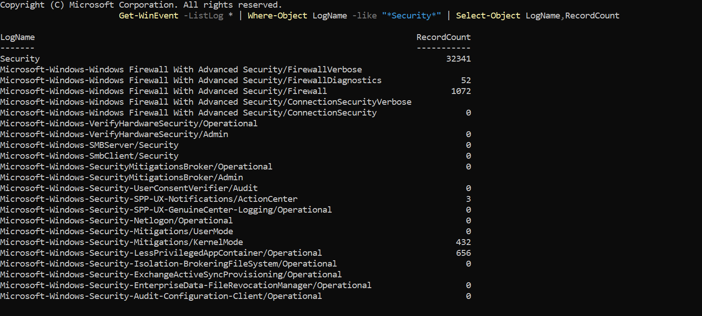
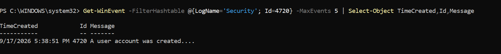
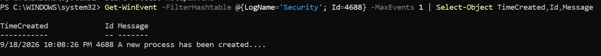
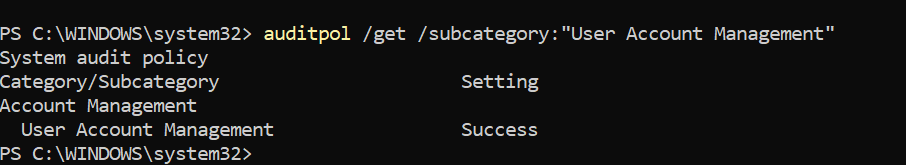

# Day 04 — Windows Event Logs & Security Monitoring

## Overview

Hands-on practice with Windows Security Event Logs and native auditing tools to understand how security-relevant activities are recorded and investigated.

This exercise focused on identifying authentication activity, account management events, and process creation events using PowerShell and Windows Audit Policy.

## Objectives

- Understand the Windows Security Event Log
- Identify important security-related Event IDs
- Investigate failed and successful logons
- Identify account creation events
- Investigate process creation events
- Check Windows audit policies
- Generate controlled security activity for investigation
- Practice basic SOC-style event analysis

## Lab Environment

- Operating System: Windows 11
- Environment: Controlled personal cybersecurity laboratory
- Tools: PowerShell, Windows Event Logs, Audit Policy
- Kali Linux: Not required for this exercise

## Security Event IDs Investigated

| Event ID | Activity | Security Relevance |
|---|---|---|
| 4625 | Failed Logon | Can indicate incorrect credentials or repeated authentication attempts |
| 4624 | Successful Logon | Records successful authentication activity |
| 4720 | User Account Created | Helps identify new account creation |
| 4688 | Process Creation | Provides visibility into newly created processes |

## Commands Practiced

### Security Event Logs

```powershell
Get-WinEvent -ListLog * | Where-Object LogName -like "*Security*" | Select-Object LogName,RecordCount
## Evidence Collected

### 1. Security Event Logs



### 2. Recent Security Events


### 3. Failed Logon — Event ID 4625


### 4. Successful Logon — Event ID 4624


### 5. Account Creation — Event ID 4720



### 6. Process Creation — Event ID 4688



### 7. User Account Management Audit Policy


