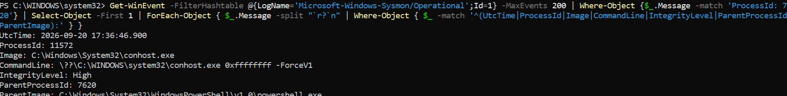
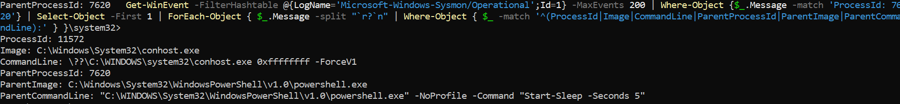

# Day 05 — Mini Incident Investigation

## Overview

Day 05 focuses on a basic SOC-style investigation of controlled PowerShell activity on a Windows endpoint.

The investigation demonstrates how Sysmon telemetry can be used to identify process creation, examine command-line activity, correlate parent and child processes, and document findings.

---

## Investigation Scenario

A controlled PowerShell process was executed on a Windows 11 laboratory endpoint.

The objective was to determine:

- What process was executed?
- What command was used?
- What was the process integrity level?
- What was the parent process?
- Did the process generate a matching network connection event?
- What security-relevant information could be collected from Sysmon?

---

## Lab Environment

| Component | Details |
|---|---|
| Operating System | Windows 11 |
| Monitoring Tool | Microsoft Sysmon |
| Log Source | Microsoft-Windows-Sysmon/Operational |
| Investigation Type | Controlled endpoint investigation |
| Environment | Personal cybersecurity laboratory |

---

## Investigation Workflow

```text
Controlled Activity
       ↓
Sysmon Event Collection
       ↓
Process Identification
       ↓
Command-Line Analysis
       ↓
Parent Process Correlation
       ↓
Network Event Check
       ↓
MITRE ATT&CK Mapping
       ↓
Analyst Assessment


---

## Evidence Collected

### 1. PowerShell Process Investigation

The Sysmon process-creation event was examined to identify the PowerShell executable, process ID, command line, integrity level, and parent process.



### 2. Parent Process Correlation

The PowerShell process was correlated with its parent process using process ID and parent-process information.



---

## Key Findings

The controlled activity generated a Sysmon **Event ID 1 — Process Create** event.

The event showed:

- Process: `powershell.exe`
- Command line: `-NoProfile -Command "Start-Sleep -Seconds 5"`
- Integrity Level: `High`
- Parent Process: `powershell.exe`
- Process creation telemetry was available through Sysmon

No matching Sysmon **Event ID 3 — Network Connection** was found for the controlled PowerShell process.

---

## Investigation Assessment

The PowerShell activity was intentionally generated inside a controlled laboratory environment.

The activity was therefore treated as **benign test activity** rather than an actual security incident.

The investigation demonstrates the type of endpoint telemetry that a SOC analyst can examine when reviewing PowerShell execution.

---

## MITRE ATT&CK Mapping

| Technique | ID | Relevance |
|---|---|---|
| PowerShell | T1059.001 | PowerShell was used to execute the controlled test command |

---

## Security Relevance

PowerShell is a legitimate Windows administration tool and can also be relevant during security investigations.

Analysts can examine:

- Process creation
- Command-line arguments
- Parent-child process relationships
- User context
- Integrity level
- Related network activity

Sysmon provides useful endpoint telemetry for this type of investigation.

---

## Learning Outcomes

This investigation provided practical experience with:

- Sysmon Event ID 1
- PowerShell process investigation
- Command-line analysis
- Parent-child process correlation
- Network-event checking
- Basic SOC investigation methodology
- MITRE ATT&CK mapping
- Security evidence documentation

---

## Ethical Scope

All activity was performed on my own controlled Windows laboratory environment for cybersecurity education and defensive security learning.

No public, third-party, or unauthorized systems were targeted.

---

## Conclusion

This exercise demonstrated a basic SOC investigation workflow using Windows and Sysmon telemetry.

The investigation showed how an analyst can move from a process-creation event to process details, parent-process correlation, network-event checking, and MITRE ATT&CK mapping.

---

## Repository Structure

```text
Day-05-Mini-Incident-Investigation/
│
├── README.md
├── investigation.md
│
└── screenshots/
    ├── 01-powershell-process-investigation.png
    └── 02-powershell-parent-process-correlation.png
