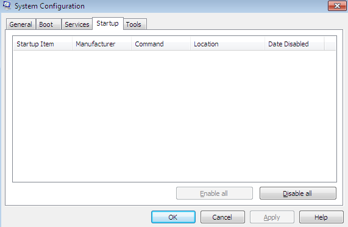
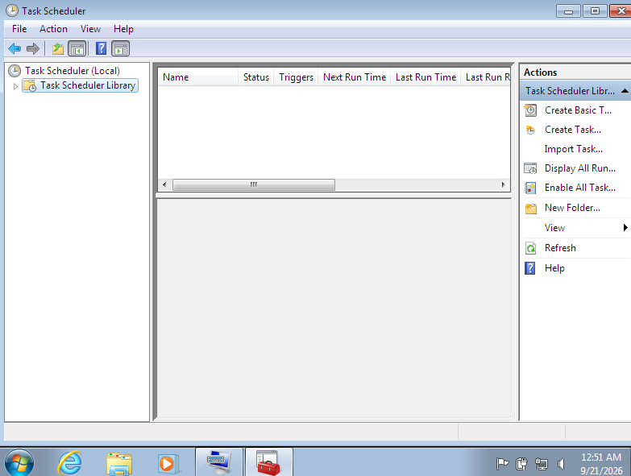

# Day 06 — Windows Persistence & Startup Investigation

## Overview

This lab focuses on investigating common Windows persistence mechanisms from a defensive cybersecurity and SOC perspective.

The investigation was performed in an isolated Windows 7 virtual machine to examine startup programs, scheduled tasks, Registry Run keys, and Windows services.

The objective was to understand where software can be configured to execute automatically and how a security analyst can inspect these locations during an endpoint investigation.

---

## Objectives

- Investigate Windows startup programs
- Examine scheduled tasks
- Inspect Registry Run keys
- Review Windows services and startup types
- Identify potential persistence locations
- Document findings as a security investigation
- Understand the relevance of persistence mechanisms to endpoint security

---

## Lab Environment

| Component | Details |
|---|---|
| Analyst Machine | Kali Linux |
| Investigation Target | Windows 7 Virtual Machine |
| Virtualization | VirtualBox |
| Environment | Isolated Lab |
| Investigation Type | Defensive / Endpoint Investigation |

---

## Investigation Areas

### 1. Startup Programs

Windows startup configuration was examined using the System Configuration utility.

Tool used:

```text
msconfig


The `Startup` tab was reviewed to identify programs configured to launch during system startup.

**Finding:** No startup entries were displayed in the Startup tab during the investigation.

### Evidence



---

### 2. Scheduled Tasks

Windows Task Scheduler was examined to identify tasks configured for automatic execution.

Tool used:

```text
taskschd.msc

The **Task Scheduler Library** was reviewed.

**Finding:** No scheduled tasks were displayed in the selected Task Scheduler Library during the investigation.

### Evidence



---

### 3. Registry Run Keys

The Windows Registry was inspected for programs configured to execute automatically when a user logs in.

Registry location examined:

```text
HKEY_LOCAL_MACHINE\SOFTWARE\Microsoft\Windows\CurrentVersion\Run

**Finding:** No configured Run entry was displayed in the examined key.

### Evidence


---

### 4. Windows Services

Windows services were reviewed using the Services management console.

Tool used:

```text
services.msc

The investigation focused on service status and startup type.

**Finding:** Multiple services were configured with Automatic or Manual startup types. These provide examples of Windows components that can be configured to start automatically or on demand.

### Evidence


---

## Investigation Workflow

The investigation followed a basic endpoint-analysis workflow:

```text
Identify Persistence Locations
          ↓
Inspect Startup Programs
          ↓
Review Scheduled Tasks
          ↓
Inspect Registry Run Keys
          ↓
Review Windows Services
          ↓
Document Findings
          ↓
Assess Security Relevance

---

## Key Findings

| Persistence Area | Observation |
|---|---|
| Startup Programs | No entries displayed |
| Scheduled Tasks | No tasks displayed in the selected library |
| Registry Run Key | No configured Run entry displayed |
| Windows Services | Multiple Automatic and Manual services observed |

These observations represent the state of the Windows 7 lab system at the time of investigation.

---

## Security Relevance

Persistence mechanisms are important during endpoint investigations because unauthorized software may attempt to configure itself to execute automatically after system startup, user logon, or through scheduled execution.

A SOC analyst can investigate these locations when determining whether an endpoint contains unexpected software or configuration changes.

The presence of an automatically starting service or other persistence mechanism does not by itself indicate malicious activity. Analysts should correlate configuration details with process information, file paths, timestamps, user activity, and other security telemetry.

---

## MITRE ATT&CK Relevance

Windows persistence mechanisms can correspond to several MITRE ATT&CK techniques depending on how they are configured.

Examples include:

- **T1547 — Boot or Logon Autostart Execution**
- **T1053 — Scheduled Task/Job**
- **T1543 — Create or Modify System Process**

The exact ATT&CK technique applicable to an observed artifact depends on the specific mechanism and evidence identified during an investigation.

---

## Learning Outcomes

Through this investigation, I practiced:

- Windows endpoint investigation
- Identifying common persistence locations
- Registry analysis
- Scheduled task analysis
- Windows service analysis
- Security-focused documentation
- Evidence collection
- SOC investigation methodology

---

## Ethical Scope

This investigation was performed only on a controlled Windows 7 virtual machine owned or operated for educational purposes.

No unauthorized systems were accessed, modified, or tested.

The purpose of this lab was defensive security learning and endpoint investigation.

---

## Conclusion

This investigation demonstrated how a security analyst can examine several common Windows locations associated with automatic execution and persistence.

Understanding these locations helps establish a foundation for detecting unauthorized configuration changes and investigating suspicious endpoint activity.

---

## Repository Structure

```text
Day-06-Windows-Persistence-Investigation/
│
├── README.md
├── investigation.md
│
└── screenshots/
    ├── 01-startup-programs.png
    ├── 02-scheduled-tasks.png
    ├── 03-registry-run-keys.png
    └── 04-services-investigation.png
