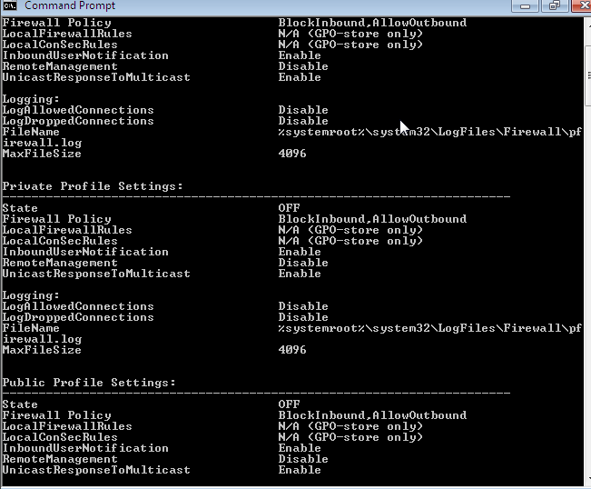
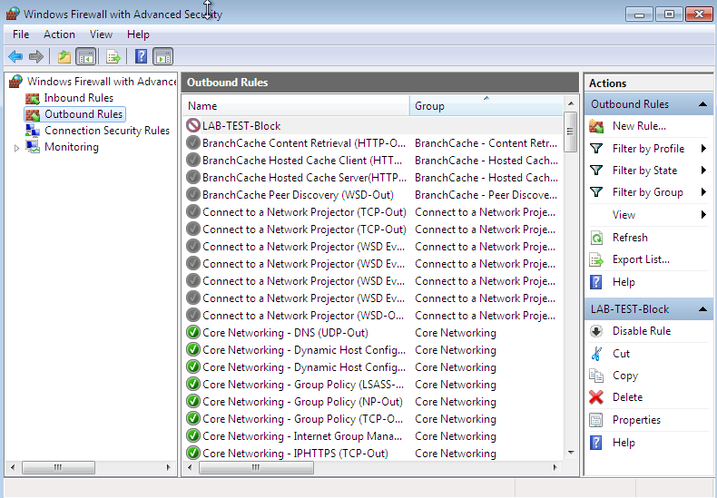
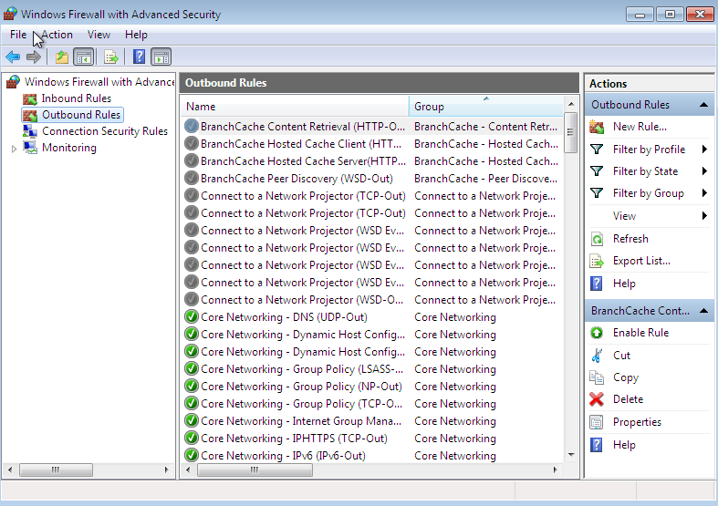
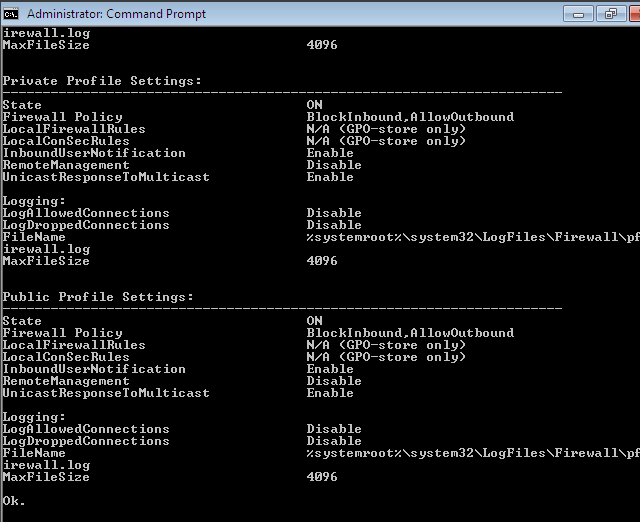

# Windows Firewall & Network Investigation — Investigation Notes

## 1. Investigation Objective

The objective of this investigation was to examine the Windows Firewall configuration from a defensive cybersecurity perspective.

The investigation was performed on a controlled Windows 7 virtual machine.

The investigation covered firewall status, firewall configuration, a controlled firewall rule, rule removal, and final firewall verification.

---

## 2. Initial Firewall Status

### Investigation

The Windows Firewall configuration was checked before beginning the investigation.

### Command Used

```text
netsh advfirewall show allprofiles

### Observation

The Windows Firewall was initially found to be **OFF**.

### Security Relevance

A disabled host firewall can reduce the endpoint's ability to enforce configured network traffic controls. Firewall status should therefore be checked during endpoint security assessments.

### Evidence



---

## 3. Firewall Enabled

### Investigation

The Windows Firewall was enabled for the remainder of the investigation.

### Command Used

```text
netsh advfirewall set allprofiles state on
```

The firewall status was then verified using:

```text
netsh advfirewall show allprofiles
```

### Observation

The Windows Firewall profiles were confirmed to be **ON**.

### Evidence


---

## 4. Firewall Configuration Investigation

### Investigation

The Windows Firewall configuration was examined using the Windows 7 compatible firewall command-line interface.

### Commands Used

```text
netsh firewall show state
```

```text
netsh firewall show config
```

### Observation

The firewall state and configuration information were reviewed to understand the current host firewall configuration.

### Security Relevance

Firewall configuration provides useful information during endpoint investigations, including the state of the firewall and configured traffic-control settings.

### Evidence


---

## 5. Controlled Firewall Rule Creation

### Investigation

A controlled firewall rule was created using **Windows Firewall with Advanced Security**.

The rule was created as an outbound TCP blocking rule for remote port `9`.

### Rule Name

```text
LAB-Test-Block
```

### Configuration

- Direction: Outbound
- Protocol: TCP
- Remote Port: 9
- Action: Block
- Purpose: Controlled laboratory testing

### Observation

The `LAB-Test-Block` rule was successfully created and displayed in the Outbound Rules section.

### Security Relevance

Firewall rules can be used to control network traffic at the host level. During security investigations, analysts should review unexpected rules and determine their purpose, scope, direction, protocol, ports, and associated programs.

### Evidence



---

## 6. Controlled Rule Removal

### Investigation

After the rule was documented, the `LAB-Test-Block` rule was removed from Windows Firewall with Advanced Security.

### Observation

The controlled test rule was removed after the investigation.

### Security Relevance

Removing temporary test configurations prevents unnecessary changes from remaining on the endpoint after a security lab exercise.

### Evidence



---

## 7. Final Firewall Verification

### Investigation

The Windows Firewall status was checked again after completing the controlled rule test.

### Command Used

```text
netsh advfirewall show allprofiles
```

### Observation

The Windows Firewall remained **ON** after the investigation and cleanup.

### Evidence



---

## 8. Evidence Summary

| Evidence | Observation |
|---|---|
| Initial Firewall Status | Firewall initially OFF |
| Firewall Enabled | Firewall enabled and verified |
| Firewall Configuration | Firewall state and configuration reviewed |
| Test Rule Created | `LAB-Test-Block` created as controlled outbound TCP rule |
| Test Rule Removed | Temporary rule removed |
| Final Firewall Status | Firewall remained ON |

---

## 9. Analyst Assessment

The investigation demonstrated the importance of checking host firewall status during a Windows endpoint security assessment.

The Windows Firewall was initially disabled and was subsequently enabled before further investigation.

A controlled outbound firewall rule named `LAB-Test-Block` was created for laboratory testing and removed after verification.

The final firewall status was checked to confirm that the firewall remained enabled after cleanup.

These observations represent the configuration state of the controlled Windows 7 laboratory system during the investigation.

---

## 10. Security Relevance

Host-based firewalls provide a layer of network traffic control on endpoints.

From a SOC and defensive security perspective, analysts can investigate:

- Firewall enabled or disabled state
- Inbound and outbound rules
- Rule direction
- Allowed or blocked actions
- Protocols and ports
- Associated programs
- Unexpected rule creation or modification
- Changes to firewall configuration

Firewall findings should be correlated with other endpoint and network telemetry when investigating suspicious activity.

---

## 11. MITRE ATT&CK Relevance

Firewall configuration and network-control activity can provide useful defensive telemetry during investigations.

Relevant network-related ATT&CK techniques depend on the behavior being investigated and the evidence available.

Firewall configuration itself should not automatically be interpreted as malicious activity. Analysts should evaluate the rule context, purpose, associated process or application, and surrounding events.

---

## 12. Investigation Workflow

```text
Check Initial Firewall State
          ↓
Enable Firewall
          ↓
Verify Firewall Configuration
          ↓
Create Controlled Test Rule
          ↓
Verify Test Rule
          ↓
Remove Test Rule
          ↓
Verify Final Firewall State
          ↓
Document Findings
```

---

## 13. Learning Outcomes

Through this investigation, I practiced:

- Windows Firewall investigation
- Windows command-line administration
- Firewall configuration analysis
- Firewall rule analysis
- Controlled security testing
- Evidence collection
- Endpoint security documentation
- SOC investigation methodology

---

## 14. Ethical Scope

This investigation was performed only on a controlled Windows 7 virtual machine used for cybersecurity education.

The firewall rule was created solely for laboratory testing.

No unauthorized systems or external targets were accessed or tested.

The temporary firewall rule was removed after the investigation.

---

## Conclusion

This investigation demonstrated how a security analyst can examine Windows Firewall status and configuration and document controlled firewall changes.

The exercise also demonstrated the importance of restoring and verifying the final security configuration after testing.

